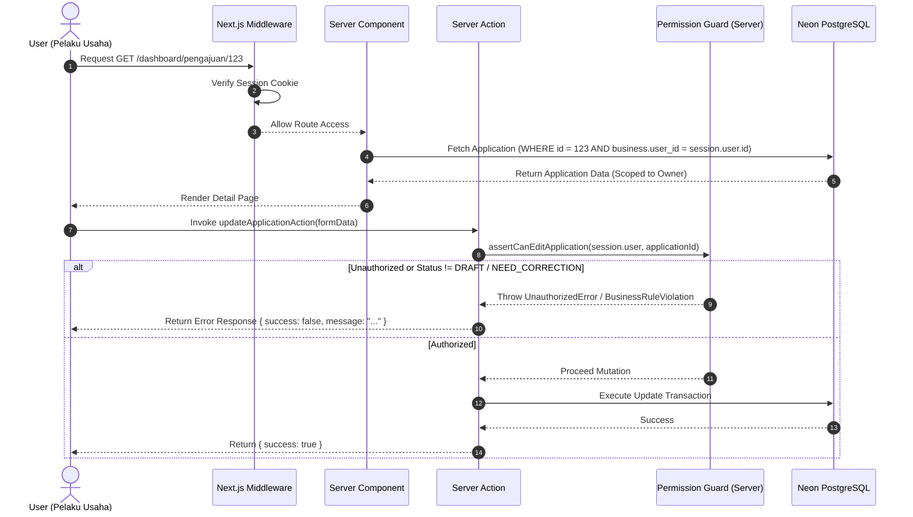
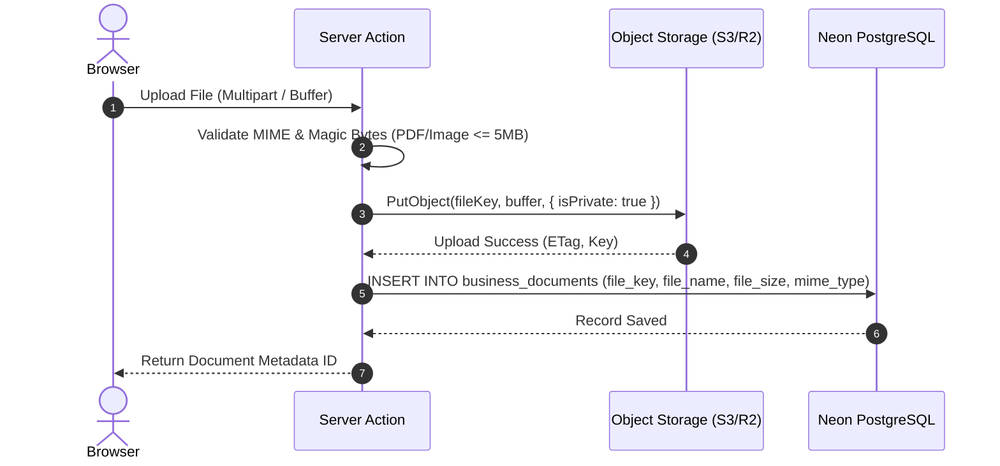

# SYSTEM DESIGN DOCUMENT (SDD)
## PLATFORM SERTIFIKASI HALAL INDONESIA (SIP-HALAL)

| Metadata Document | Details |
|---|---|
| **Project Name** | Platform Sertifikasi Halal Terpadu |
| **Document Version** | 1.0.0 |
| **Status** | Approved for Database & ERD Design |
| **Architect** | Senior System Architect & Senior Security Engineer |
| **Tech Stack** | Next.js 14+ (App Router), TypeScript (Strict), Tailwind CSS, shadcn/ui, Drizzle ORM, Neon PostgreSQL |

---

## 1. APPLICATION ARCHITECTURE OVERVIEW

Arsitektur aplikasi dibangun dengan pola **Modern Multi-Tier Server-Driven Architecture** memanfaatkan kapabilitas Next.js App Router, React Server Components (RSC), Server Actions untuk mutasi data berkeamanan tinggi, dan Drizzle ORM yang terhubung langsung ke database serverless Neon PostgreSQL.

```mermaid
flowchart TD
    subgraph ClientLayer ["Client Layer (Browser)"]
        UI["React Server / Client Components (shadcn/ui + Tailwind)"]
        FormClient["React Hook Form + Zod Client Validation"]
    end

    subgraph EdgeMiddleware ["Edge & Routing Layer"]
        MW["Next.js Middleware (Auth Session & Route Guard)"]
    end

    subgraph ServerLayer ["Next.js Server Runtime (Node.js/Serverless)"]
        RSC["Server Components (Data Fetching & Rendering)"]
        SA["Server Actions (Mutations & Business Logic)"]
        RH["Route Handlers (API, Webhooks, PDF Streaming)"]
        AuthService["Auth & Session Service (Iron-Session / Jose JWT)"]
        StorageService["Object Storage Client (S3 / R2 / Supabase Storage)"]
        PDFService["PDF Generation Engine (pdf-lib / @react-pdf)"]
        QRService["QR Code Generation Service (qrcode)"]
    end

    subgraph DataLayer ["Data & Storage Layer"]
        Drizzle["Drizzle ORM (Type-Safe Query Builder)"]
        NeonDB[("Neon PostgreSQL Serverless (Pooler / HA)")]
        S3Storage[("Object Storage (S3 / Cloudflare R2)")]
    end

    UI -->|HTTP Requests| MW
    MW -->|Authorized Navigation| RSC
    FormClient -->|Direct Server Invocation| SA
    UI -->|Blob / Verification Request| RH
    
    RSC -->|Queries| Drizzle
    SA -->|Validation (Zod Server)| Drizzle
    SA -->|Store Metadata| StorageService
    SA -->|Generate Signatures| QRService
    RH -->|Stream Document| PDFService
    
    StorageService --> S3Storage
    Drizzle -->|TCP / SSL Pooler| NeonDB
```

---

## 2. FOLDER & CODEBASE ARCHITECTURE

Struktur direktori disusun modular, memisahkan concern antara presentasi (UI), logika bisnis (actions/services), database access (drizzle), dan utilitas inti.

```text
src/
├── app/                                    # Next.js App Router
│   ├── (public)/                           # Public routes (Landing, FAQ, Alur, Kontak)
│   │   ├── page.tsx                        # Landing page
│   │   ├── tentang/page.tsx
│   │   ├── layanan/page.tsx
│   │   ├── alur/page.tsx
│   │   ├── faq/page.tsx
│   │   └── verify/                         # Public Certificate Verification
│   │       ├── page.tsx                    # Search by certificate number
│   │       └── [certificateNumber]/page.tsx # Direct QR Code landing
│   ├── (auth)/                             # Authentication routes
│   │   ├── login/page.tsx
│   │   ├── register/page.tsx
│   │   ├── forgot-password/page.tsx
│   │   └── reset-password/page.tsx
│   ├── dashboard/                          # Pelaku Usaha (Business Owner) Portal
│   │   ├── layout.tsx                      # Dashboard sidebar & topbar
│   │   ├── page.tsx                        # Overview & metrik usaha
│   │   ├── profil-usaha/                   # Business profile & legalities
│   │   ├── produk/                         # Product catalog & BOM mapping
│   │   ├── bahan/                          # Material catalog & halal docs
│   │   ├── pengajuan/                      # Application submission & tracking
│   │   │   ├── new/page.tsx                # Multi-step application form
│   │   │   └── [id]/page.tsx               # Detail & timeline
│   │   ├── perbaikan/                      # Dedicated correction inbox
│   │   ├── sertifikat/                     # Download issued certificates
│   │   └── notifikasi/page.tsx
│   ├── admin/                              # Admin & Verifier Portal
│   │   ├── layout.tsx
│   │   ├── page.tsx                        # Executive summary & SLA charts
│   │   ├── pengajuan/                      # Queue & verification workbench
│   │   ├── penugasan/                      # Auditor & Mentor assignment
│   │   ├── pelaku-usaha/                   # Directory of registered businesses
│   │   ├── master/                         # Master data (Wilayah, Kategori)
│   │   ├── audit-logs/                     # Security & mutation logs
│   │   └── users/                          # User & role management
│   ├── mentor/                             # Pendamping PPH Portal (Self-Declare)
│   │   ├── layout.tsx
│   │   ├── page.tsx
│   │   └── penugasan/                      # Assigned UMKM & verification
│   ├── auditor/                            # Auditor Halal / LPH Portal (Reguler)
│   │   ├── layout.tsx
│   │   ├── page.tsx
│   │   ├── jadwal/                         # Inspection schedule
│   │   └── pemeriksaan/                    # Checklist SJPH & findings
│   └── api/                                # Route Handlers (REST / Webhooks)
│       ├── certificates/[id]/download/route.ts # PDF download stream
│       └── health/route.ts                 # Healthcheck endpoint
│
├── components/                             # Reusable UI Components
│   ├── ui/                                 # shadcn/ui base primitives (button, dialog, etc.)
│   ├── forms/                              # Composite form components (Zod + RHF)
│   ├── tables/                             # Generic DataTable (sorting, filtering, pagination)
│   ├── dashboard/                          # Dashboard widgets, stats card, timelines
│   ├── certificate/                        # Certificate preview & PDF layout
│   └── shared/                             # Navbar, footer, breadcrumb, empty-state, skeleton
│
├── actions/                                # Next.js Server Actions (Mutations)
│   ├── auth.actions.ts                     # Login, register, logout, reset-pass
│   ├── business.actions.ts                 # Create/update profile, facility, legal docs
│   ├── product.actions.ts                  # Product CRUD & recipe material linking
│   ├── material.actions.ts                 # Material CRUD & supplier docs
│   ├── application.actions.ts              # Submit, update draft, cancel
│   ├── verification.actions.ts             # Item checklist review, need correction, approve
│   ├── inspection.actions.ts               # Schedule audit, checklist SJPH, findings
│   ├── certificate.actions.ts              # Generate PDF certificate, verify QR
│   └── master.actions.ts                   # Master data maintenance
│
├── db/                                     # Database Layer
│   ├── index.ts                            # Drizzle client & Neon Pooler connection
│   ├── schema/                             # Modular Drizzle Schemas
│   │   ├── auth.schema.ts                  # Users, sessions, roles, permissions
│   │   ├── business.schema.ts              # Businesses, facilities, legal docs
│   │   ├── product-material.schema.ts      # Products, materials, BOM pivot
│   │   ├── application.schema.ts           # Applications, histories, checklists
│   │   ├── audit.schema.ts                 # Assignments, findings, LHP
│   │   ├── certificate.schema.ts           # Certificates, verification records
│   │   ├── master.schema.ts                # Provinces, cities, categories
│   │   └── system.schema.ts                # Audit logs, notifications
│   ├── migrations/                         # Drizzle SQL migrations
│   └── seed/                               # Database seeder (Roles, Admin, Master Data)
│
├── lib/                                    # Core Utilities & Business Services
│   ├── auth/                               # Auth helper, session tokens, password hashing
│   ├── permissions/                        # RBAC & authorization assertion helpers
│   ├── validation/                         # Zod schemas (Auth, Business, App, etc.)
│   ├── storage/                            # Object storage abstraction (Upload, Presign, Delete)
│   ├── pdf/                                # PDF generation template & engine
│   ├── qr/                                 # QR Code SVG/PNG generator
│   └── utils/                              # Formatters (Date, IDR, String mask)
│
├── hooks/                                  # Custom React Client Hooks
├── types/                                  # Global TypeScript Type Definitions
└── config/                                 # App constants, navigation config, site metadata
```

---

## 3. AUTHENTICATION & AUTHORIZATION ARCHITECTURE

### 3.1 Authentication Mechanism
- **Model:** Stateless Secure Cookie Session (HMAC signed + AES-256 encrypted using `iron-session` / `jose` JWT with high-entropy secret).
- **Session Lifecycle:**
  - Token masa berlaku: 7 hari (sliding session pada setiap interaksi aktif).
  - Cookie flags: `HttpOnly`, `Secure` (production), `SameSite=Lax`, `Path=/`.
- **Password Security:** Hashing menggunakan **Argon2id** (atau `bcryptjs` salt rounds 12) dengan perlindungan timing attack.
- **Rate Limiting:** IP & Account based limiting pada endpoint `/login` dan `/register` (maks 5 kali percobaan gagal per 15 menit).

### 3.2 Authorization (RBAC & Multi-Tenancy Data Guard)
Otorisasi diperiksa dalam dua lapisan:
1. **Perimeter Guard (Next.js Middleware):** Memeriksa validitas session token dan izin akses rute dasar (misal: memblokir non-admin ke `/admin/*`).
2. **Domain Action Guard (Server Actions & Data Layer):** Validasi hak akses ketat di tingkat server sebelum mengeksekusi mutasi atau membaca record privat.



---

## 4. DATABASE ARCHITECTURE (NEON POSTGRESQL + DRIZZLE ORM)

### 4.1 Connection Strategy
- Menggunakan `@neondatabase/serverless` atau `pg` Pooler dengan connection string yang diatur untuk mode pooled:
  - Connection Pooling untuk Serverless Next.js functions (port 5432 / Neon pooler mode).
  - Otomasi reconnect & SSL termination (`sslmode=require`).
- **Primary Key:** UUID v4 (`gen_random_uuid()`) untuk mencegah enumerasi ID publik dan memudahkan migrasi data.
- **Foreign Keys & Indices:** Semua relasi diberi index eksplisit untuk query join berkecepatan tinggi.
- **Audit Columns:** Setiap entitas memiliki `created_at`, `updated_at`, dan `deleted_at` (soft delete bila relevan).

---

## 5. FILE STORAGE ARCHITECTURE (OBJECT STORAGE)

Dokumen seperti NIB, KTP, Foto Produk, Manual SJPH, dan Sertifikat Halal Bahan **TIDAK** disimpan sebagai binary (BYTEA) di dalam PostgreSQL.

### 5.1 Storage Workflow
1. **Metadata Storage:** Database hanya menyimpan metadata: `id`, `file_name`, `file_key`, `file_size`, `mime_type`, `storage_bucket`, `is_public`.
2. **Private Document Handling (KTP, NIB, Draft Form):**
   - Disimpan pada private bucket.
   - Akses pembacaan melalui **Presigned URL** berbatas waktu (TTL 15 menit) yang digenerate oleh server hanya untuk user yang terotorisasi.
3. **Public Assets (Foto Produk, Sertifikat Final):**
   - Sertifikat publik dapat diunduh melalui Route Handler streaming dengan header caching yang sesuai.
4. **Validation Pipeline:**
   - Client-side pre-validation: Max size (5MB), ekstensi file (`.pdf`, `.jpg`, `.png`).
   - Server-side validation: Magic number inspection (memverifikasi header byte sebenarnya bukan sekadar nama ekstensi).



---

## 6. PDF & QR CODE GENERATION ENGINE

### 6.1 Certificate Generator Pipeline
1. **Trigger:** Leader/Pimpinan melakukan *Final Approval* pada pengajuan sertifikasi.
2. **Payload Compilation:** Server mengumpulkan data resmi: Nomor Sertifikat, Nama Usaha, NIB, Alamat, Daftar Produk yang disetujui, Tanggal Keputusan, Tanggal Terbit.
3. **Digital Signature & QR Code:**
   - Server membuat payload URL verifikasi: `${NEXT_PUBLIC_APP_URL}/verify/${certificateNumber}`.
   - Meng-generate QR Code beresolusi tinggi (PNG/Vector) dengan redundancy level high (Level H).
4. **Rendering PDF:**
   - PDF dibuat menggunakan `pdf-lib` / `@react-pdf/renderer` dengan template resmi:
     - Border ornamen hijau emerald & aksen gold.
     - Logo Lembaga & Watermark keamanan "ORIGINAL CERTIFIED".
     - QR Code verifikasi di pojok bawah.
     - Lampiran daftar produk terlampir (multi-page auto layout).
5. **Storage & Archiving:**
   - PDF diunggah ke Object Storage.
   - Record `certificates` diperbarui dengan status `ACTIVE` dan link dokumen.

---

## 7. NOTIFICATION & AUDIT LOGGING ARCHITECTURE

### 7.1 Notification Architecture
- **Penyimpanan:** Tabel `notifications` di PostgreSQL (`user_id`, `title`, `message`, `type`, `action_url`, `is_read`).
- **Channel Delivery:**
  - **MVP:** In-app Notification Drawer dengan badge counter realtime.
  - **Extensible Layer:** Desain modular `NotificationDispatcher` untuk integrasi masa depan ke Email (Resend/Nodemailer) dan WhatsApp (Waba/Fonnte).

### 7.2 Audit Logging Engine
Setiap mutasi penting (Create, Update, Status Change, Verification, Approval, Delete) wajib memanggil helper `createAuditLog()`:
- `user_id`: Pengguna yang melakukan aksi.
- `action`: `APPLICATION_SUBMITTED`, `DOCUMENT_VERIFIED`, `CORRECTION_REQUESTED`, `FINAL_APPROVED`, dll.
- `entity_type`: `applications`, `businesses`, `products`, `certificates`.
- `entity_id`: UUID entitas.
- `old_values`: JSON payload sebelum perubahan.
- `new_values`: JSON payload setelah perubahan.
- `ip_address` & `user_agent`: Dicatat dari request headers.

---

## 8. ERROR HANDLING & VALIDATION STRATEGY

### 8.1 Validation Architecture
- Menggunakan **Zod** sebagai *Single Source of Truth* untuk validasi:
  - Form Schemas (Client Validation via React Hook Form `@hookform/resolvers/zod`).
  - Server Action Input Validation (Mencegah bypass client-side).
  - API Payload Validation.

### 8.2 Standardized Error & Response Envelope
Semua Server Actions mengembalikan struktur data konsisten:

```typescript
export type ActionResult<T = unknown> = 
  | { success: true; data: T; message?: string }
  | { success: false; error: string; errors?: Record<string, string[]>; code?: string };
```

- Error transaksional di-catch dan di-format ke bahasa Indonesia yang ramah pengguna.
- Unhandled error dicatat ke error log server tanpa mengekspos stack trace ke client.

---

## 9. SECURITY & HARDENING ARCHITECTURE

| Vektor Ancaman | Solusi & Mekanisme Hardening |
|---|---|
| **SQL Injection** | Menggunakan Drizzle ORM dengan parameterized queries secara penuh (tanpa raw string concatenation). |
| **XSS (Cross-Site Scripting)** | React JSX auto-escaping bawaan, Content-Security-Policy (CSP) headers, dan sanitasi input HTML jika ada. |
| **CSRF** | Next.js Server Actions dilengkapi anti-CSRF token bawaan melalui header Origin/Host validation. |
| **Broken Access Control** | Validasi kepemilikan data (Ownership Check) di setiap Server Action, bukan hanya middleware URL. |
| **File Upload Vulnerabilities** | Sanitasi nama file, pembatasan MIME type & Magic Bytes, file size limit (5MB), isolasi di Object Storage tanpa izin eksekusi script. |
| **Sensitive Data Exposure** | Password di-hash menggunakan Argon2/bcrypt; NIK/KTP hanya bisa dilihat oleh verifikator berhak; endpoint verifikasi publik hanya menampilkan data non-sensitif. |
| **HTTP Security Headers** | Konfigurasi headers: `X-Frame-Options: DENY`, `X-Content-Type-Options: nosniff`, `Referrer-Policy: strict-origin-when-cross-origin`, `Permissions-Policy`. |

---

## 10. CACHING, PERFORMANCE & SCALABILITY

1. **Static vs Dynamic Rendering:**
   - Halaman Publik (Landing, Alur, Panduan, FAQ): **Static Generation (ISR)** untuk performa instan dan SEO maksimal.
   - Halaman Verifikasi Sertifikat: **Dynamic Server Rendering (No-Store / On-Demand Revalidation)** agar hasil verifikasi selalu akurat terhadap database.
   - Dashboard: Dynamic Rendering dengan optimistic UI updates pada form interaktif.
2. **Database Optimization:**
   - Indeks komposit pada tabel relasi (`product_materials`, `application_products`).
   - Query pagination server-side menggunakan `limit` & `offset` / keyset pagination pada tabel antrean pengajuan.
3. **Asset Optimization:**
   - Next.js `next/image` untuk otomatisasi kompresi WebP/AVIF foto produk.
   - Bundle splitting & tree shaking otomatis bawaan Next.js.

---

## 11. DEPLOYMENT & CI/CD ARCHITECTURE

```mermaid
flowchart LR
    Dev["Developer (Git Push)"] --> GitHub["GitHub Repository"]
    
    subgraph Pipeline ["CI / CD Pipeline"]
        Lint["Lint & Typecheck (tsc --noEmit)"]
        Test["Unit & Integration Tests"]
        Build["Next.js Production Build"]
    end
    
    subgraph Production ["Production Environment"]
        Vercel["Vercel Edge / Serverless Runtime"]
        Neon["Neon Serverless PostgreSQL (US-East / Singapore)"]
        S3Bucket["Object Storage (R2 / S3)"]
    end

    GitHub --> Lint --> Test --> Build
    Build -->|Deploy Artifact| Vercel
    Vercel -->|Database Connection (Pooled)| Neon
    Vercel -->|Storage API| S3Bucket
```

- **Environment Separation:** `.env.production` terisolasi di Vercel Dashboard; `.env.local` lokal untuk development.
- **Database Migration:** Drizzle Kit migrations dieksekusi secara terpisah sebelum deployment produksi berjalan (`npm run db:migrate`).

---
*Dokumen ini menjadi cetak biru teknis untuk penyusunan PostgreSQL Database Schema & ERD (docs/03-database-erd.md) dan implementasi kode selanjutnya.*
