# DATABASE ARCHITECTURE & ENTITY RELATIONSHIP DIAGRAM (ERD)
## PLATFORM SERTIFIKASI HALAL INDONESIA (SIP-HALAL)

| Metadata Document | Details |
|---|---|
| **Project Name** | Platform Sertifikasi Halal Terpadu |
| **Document Version** | 1.0.0 |
| **Status** | Approved for Implementation |
| **Database Engine** | PostgreSQL 16+ (Neon Serverless Pooler) |
| **ORM Framework** | Drizzle ORM (Type-Safe TypeScript Schema) |

---

## 1. DATABASE DESIGN OVERVIEW & CONVENTIONS

1. **Primary Keys:** Menggunakan `UUID v4` (`uuid("id").defaultRandom().primaryKey()`) untuk seluruh entitas transaksional demi keamanan dari enumerasi URL ID dan skalabilitas distribusi data.
2. **Audit Columns:** Setiap tabel dilengkapi:
   - `created_at`: `timestamp("created_at", { withTimezone: true }).defaultNow().notNull()`
   - `updated_at`: `timestamp("updated_at", { withTimezone: true }).defaultNow().notNull()`
   - `deleted_at`: `timestamp("deleted_at", { withTimezone: true })` (Soft delete untuk master dan profil usaha).
3. **Foreign Keys & Referential Integrity:** Menggunakan aturan eksplisit `onDelete: "cascade"` untuk child entities (seperti alamat usaha, item pivot bahan) dan `onDelete: "restrict"` untuk data berstatus legal (seperti riwayat sertifikat atau log pengajuan).
4. **Enums & State Constraints:** Menggunakan PostgreSQL native enum untuk status workflow, peran pengguna (roles), dan kategori skala bisnis guna menjamin integritas nilai data.
5. **Indexing Strategy:** Seluruh foreign keys, kolom pencarian (search query), kode status pengajuan, serta nomor sertifikat diberi indeks b-tree eksplisit.

---

## 2. COMPLETE ENTITY RELATIONSHIP DIAGRAM (MERMAID)

```mermaid
erDiagram
    USERS ||--o{ USER_ROLES : has
    ROLES ||--o{ USER_ROLES : assigned_to
    ROLES ||--o{ ROLE_PERMISSIONS : grants
    PERMISSIONS ||--o{ ROLE_PERMISSIONS : includes
    
    USERS ||--o{ BUSINESSES : owns
    BUSINESSES ||--o{ BUSINESS_ADDRESSES : located_at
    BUSINESSES ||--o{ BUSINESS_DOCUMENTS : owns_legals
    BUSINESSES ||--o{ BUSINESS_SUPERVISORS : employs_halal_supervisor
    
    PROVINCES ||--o{ CITIES : contains
    CITIES ||--o{ DISTRICTS : contains
    DISTRICTS ||--o{ VILLAGES : contains
    VILLAGES ||--o{ BUSINESS_ADDRESSES : references_area
    
    BUSINESSES ||--o{ PRODUCTS : produces
    PRODUCT_CATEGORIES ||--o{ PRODUCTS : classifies
    PRODUCTS ||--o{ PRODUCT_DOCUMENTS : attachments
    
    BUSINESSES ||--o{ MATERIALS : registers
    MATERIAL_CATEGORIES ||--o{ MATERIALS : classifies
    MATERIALS ||--o{ MATERIAL_DOCUMENTS : has_halal_proof
    
    PRODUCTS ||--o{ PRODUCT_MATERIALS : formulated_with
    MATERIALS ||--o{ PRODUCT_MATERIALS : ingredient_of
    
    BUSINESSES ||--o{ APPLICATIONS : submits
    APPLICATIONS ||--o{ APPLICATION_PRODUCTS : contains_scope
    PRODUCTS ||--o{ APPLICATION_PRODUCTS : included_in
    APPLICATIONS ||--o{ APPLICATION_DOCUMENTS : submitted_files
    APPLICATIONS ||--o{ APPLICATION_STATUS_HISTORIES : tracks_timeline
    APPLICATIONS ||--o{ APPLICATION_CHECKLISTS : verified_by_items
    
    USERS ||--o{ MENTORS : profile_as_mentor
    APPLICATIONS ||--o{ MENTOR_ASSIGNMENTS : assigned_to_mentor
    MENTORS ||--o{ MENTOR_ASSIGNMENTS : receives_task
    
    USERS ||--o{ AUDITORS : profile_as_auditor
    APPLICATIONS ||--o{ AUDITOR_ASSIGNMENTS : assigned_to_auditor
    AUDITORS ||--o{ AUDITOR_ASSIGNMENTS : receives_task
    
    APPLICATIONS ||--o{ INSPECTION_SCHEDULES : scheduled_for
    APPLICATIONS ||--o{ INSPECTION_RESULTS : evaluated_in
    INSPECTION_RESULTS ||--o{ INSPECTION_FINDINGS : contains_findings
    
    APPLICATIONS ||--o| CERTIFICATES : generates_on_approval
    CERTIFICATES ||--o{ CERTIFICATE_PRODUCTS : certifies_products
    PRODUCTS ||--o{ CERTIFICATE_PRODUCTS : certified_as
    
    USERS ||--o{ NOTIFICATIONS : receives
    USERS ||--o{ AUDIT_LOGS : performs_action
```

---

## 3. DETAILED TABLE STRUCTURE & DOMAINS

### 3.1 Domain 1: Auth & User Management
- **`users`**: Informasi akun pengguna (id, email, password_hash, full_name, phone_number, avatar_url, is_active, email_verified_at, timestamps).
- **`roles`**: Master peran (`SUPER_ADMIN`, `ADMIN`, `VERIFIER`, `MENTOR`, `AUDITOR`, `LEADER`, `BUSINESS_OWNER`).
- **`permissions`**: Hak akses granular (`product:create`, `application:verify`, `certificate:approve`, dll.).
- **`role_permissions`**: Pivot tabel hak akses peran.
- **`user_roles`**: Pivot tabel penetapan peran kepada pengguna.
- **`user_sessions`**: Penyimpanan sesi aktif dan revocation list.

### 3.2 Domain 2: Master Data Wilayah & Klasifikasi
- **`provinces`**, **`cities`**, **`districts`**, **`villages`**: Master data kode wilayah resmi Indonesia.
- **`product_categories`**: Kategori produk halal (Makanan Olahan, Minuman, Daging Segar, Kosmetik, Obat Tradisional, dll.).
- **`material_categories`**: Kategori bahan baku (Bahan Nabati, Hewani, Kimia/Tambang, Mikrobial, Bahan Penolong).

### 3.3 Domain 3: Profil Usaha & Legalitas
- **`businesses`**: Profil entitas bisnis (id, user_id, name, brand_name, business_type [PT/CV/Perorangan/dll], business_scale [MIKRO/KECIL/MENENGAH/BESAR], nib, npwp, phone, email, is_active).
- **`business_addresses`**: Multi-fasilitas produksi dan kantor (business_id, address_type [HEADQUARTERS/FACTORY/OUTLET], address_line, village_id, postal_code, latitude, longitude).
- **`business_documents`**: Dokumen legalitas (business_id, document_type [NIB_FILE, KTP_OWNER, FACILITY_PHOTO, HALAL_COMMITMENT], file_name, file_key, file_size, mime_type, verification_status).
- **`business_supervisors`**: Data Penyelia Halal (business_id, name, id_card_number, sk_number, phone, certificate_number, certificate_file_key).

### 3.4 Domain 4: Produk, Bahan, dan Formulasi (BOM)
- **`materials`**: Master bahan pelaku usaha (id, business_id, category_id, name, trade_name, manufacturer, is_halal_certified, halal_cert_number, cert_issuer, cert_valid_until).
- **`material_documents`**: File lampiran sertifikat halal bahan supplier.
- **`products`**: Katalog produk (id, business_id, category_id, name, brand_name, description, photo_key, serving_type, shelf_life).
- **`product_materials`**: Pivot formulir resep matriks bahan (`product_id`, `material_id`, `usage_description`, `is_alternative_material`).
- **`product_documents`**: Dokumen desain kemasan, izin edar P-IRT/BPOM.

### 3.5 Domain 5: Pengajuan Sertifikasi & Workflow
- **`applications`**: Entitas pengajuan (id, business_id, application_number [misal: `APP-2026-XXXXXX`], scheme_type [`SELF_DECLARE` / `REGULER`], status, submission_date, estimated_completion_date, notes, created_at, updated_at).
- **`application_products`**: Daftar produk yang diajukan dalam sertifikasi ini (`application_id`, `product_id`).
- **`application_documents`**: Berkas spesifik pengajuan (Manual SJPH, Surat Permohonan, Bukti Pelatihan Halal).
- **`application_status_histories`**: Log immutable perpindahan status (`application_id`, `previous_status`, `new_status`, `changed_by_user_id`, `notes`, `created_at`).
- **`application_checklists`**: Checklist verifikasi dokumen verifikator (`application_id`, `checklist_item_key`, `is_valid`, `correction_notes`, `verified_by_user_id`).

### 3.6 Domain 6: Penugasan & Audit Lapangan
- **`mentors`** & **`mentor_assignments`**: Profil pendamping dan penugasan pada skema Self-Declare.
- **`auditors`** & **`auditor_assignments`**: Profil auditor LPH dan penugasan pada skema Reguler.
- **`inspection_schedules`**: Jadwal visitasi lapangan/audit on-site (`application_id`, `assigned_auditor_id`, `scheduled_date`, `status`, `location_address`).
- **`inspection_results`**: Lembar Hasil Pemeriksaan (LHP) (`application_id`, `auditor_id`, `recommendation` [LAYAK / TIDAK_LAYAK / PERBAIKAN], `summary_notes`, `completed_at`).
- **`inspection_findings`**: Temuan ketidaksesuaian audit (`inspection_result_id`, `finding_type` [MINOR/MAYOR], `description`, `photo_evidence_key`, `correction_due_date`, `is_resolved`).

### 3.7 Domain 7: Sertifikat Halal & Verifikasi Publik
- **`certificates`**: Sertifikat resmi terbit (id, application_id, certificate_number [Unik, contoh: `HALAL-2026-000001`], business_name, business_address, issue_date, valid_until, status [`ACTIVE`, `REVOKED`, `EXPIRED`], qr_code_url, pdf_file_key, digital_signature_hash).
- **`certificate_products`**: Salinan snapshot produk dan merek yang tercantum dalam sertifikat (`certificate_id`, `product_name`, `brand_name`, `category_name`).

### 3.8 Domain 8: Notifikasi & Audit Log Sistem
- **`notifications`**: In-app notifications (`id`, `user_id`, `title`, `message`, `type`, `action_url`, `is_read`, `created_at`).
- **`audit_logs`**: System audit trail (`id`, `user_id`, `action`, `entity_type`, `entity_id`, `old_values`, `new_values`, `ip_address`, `user_agent`, `created_at`).

---
*Seluruh struktur tabel di atas diimplementasikan secara type-safe pada direktori `src/db/schema/` menggunakan Drizzle ORM.*
