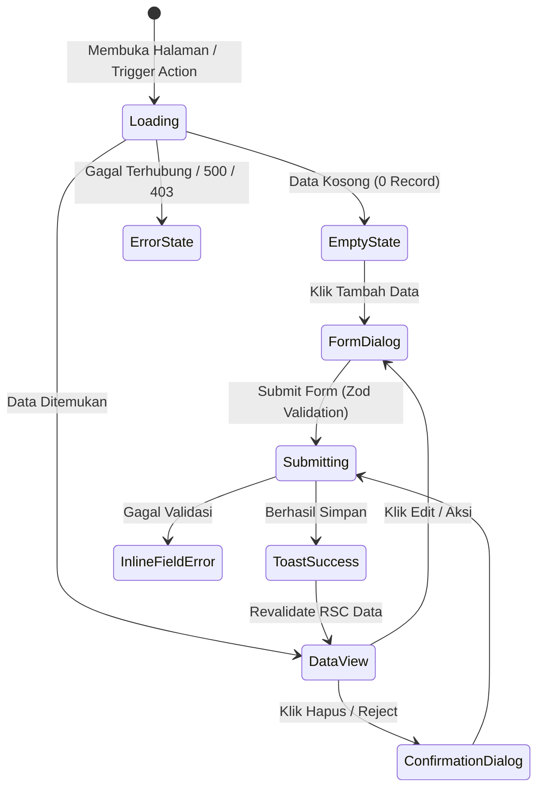

# UI/UX DESIGN SPECIFICATION & DESIGN SYSTEM
## PLATFORM SERTIFIKASI HALAL INDONESIA (SIP-HALAL)

| Metadata Document | Details |
|---|---|
| **Project Name** | Platform Sertifikasi Halal Terpadu |
| **Document Version** | 1.0.0 |
| **Status** | Approved for Project Structure Setup |
| **Design Concept** | Modern Government Enterprise + Halal Professional |
| **UI Framework** | Tailwind CSS + shadcn/ui + Radix UI Primitives + Lucide Icons |

---

## 1. DESIGN PHILOSOPHY & PRINCIPLES

1. **Clean & Trustworthy:** Menampilkan citra institusi resmi dengan tata letak yang lapang (*spacious*), minim distraksi visual, dan fokus pada kejelasan informasi perizinan.
2. **Accessible & Inclusive:** Mematuhi standar aksesibilitas WCAG 2.1 Level AA dengan rasio kontras warna teks terhadap latar belakang minimal 4.5:1.
3. **Mobile-First & Fully Responsive:** Dioptimalkan secara sempurna untuk smartphone (360px–480px) bagi kemudahan pelaku UMKM di lapangan, hingga monitor desktop enterprise (1920px).
4. **Action-Oriented & Transparent Workflow:** Setiap tahapan verifikasi, catatan perbaikan (*correction notes*), dan status pengajuan disajikan dengan visual cue yang jelas dan tidak ambigu.

---

## 2. COLOR PALETTE & DESIGN SYSTEM TOKENS

### 2.1 Core Palette (Halal Modern Enterprise)

```css
/* Tailwind CSS / CSS Variables Tokens */
:root {
  /* Brand Primary: Deep Emerald Green (Kredibilitas, Keislaman, Ekosistem Halal) */
  --primary-50: #ecfdf5;
  --primary-100: #d1fae5;
  --primary-200: #a7f3d0;
  --primary-500: #10b981;
  --primary-600: #059669;
  --primary-700: #047857;
  --primary-800: #065f46;  /* Primary Brand Main */
  --primary-900: #064e3b;

  /* Accent: Noble Gold / Amber (Keunggulan, Sertifikasi Resmi, Nilai Tambah) */
  --accent-50: #fffbeb;
  --accent-100: #fef3c7;
  --accent-400: #fbbf24;
  --accent-500: #f59e0b;
  --accent-600: #d97706;  /* Primary Accent Main */
  --accent-700: #b45309;

  /* Neutral Background & Surface */
  --bg-main: #f8fafc;       /* Slate 50 (Page Background) */
  --bg-surface: #ffffff;    /* Pure White (Card & Modal Surface) */
  --bg-sidebar: #064e3b;    /* Deep Emerald Dark (Admin & Dashboard Sidebar) */
  
  /* Text & Content */
  --text-primary: #0f172a;   /* Slate 900 */
  --text-secondary: #475569; /* Slate 600 */
  --text-muted: #94a3b8;     /* Slate 400 */

  /* State & Feedback Colors */
  --state-success: #16a34a;  /* Green 600 */
  --state-warning: #ea580c;  /* Orange 600 (Need Correction) */
  --state-danger: #dc2626;   /* Red 600 (Rejected) */
  --state-info: #0284c7;     /* Sky 600 (In Progress) */
}
```

---

## 3. TYPOGRAPHY SYSTEM

| Role | Font Family | Weights | Sizing / Line-Height | Kegunaan |
|---|---|---|---|---|
| **Headings (H1 - H4)** | `Poppins`, sans-serif | 600 (SemiBold), 700 (Bold) | H1: 36px/44px<br>H2: 30px/38px<br>H3: 24px/32px<br>H4: 20px/28px | Hero titles, Page headings, Modal titles, Certificate typography. |
| **Body & UI Text** | `Inter`, sans-serif | 400 (Regular), 500 (Medium), 600 (SemiBold) | Base: 16px/24px<br>Small: 14px/20px<br>XSmall: 12px/16px | Form labels, table cells, paragraph descriptions, tooltips, buttons. |
| **Monospace / Code** | `JetBrains Mono`, monospace | 500 (Medium) | 13px/18px | Nomor Sertifikat (`HALAL-2026-000001`), NIB, Kode Wilayah. |

---

## 4. PUBLIC WEBSITE ARCHITECTURE & PAGES

```text
[ PUBLIC NAVBAR ]
├── Logo SIP-HALAL
├── Beranda
├── Layanan (Self-Declare & Reguler)
├── Alur Sertifikasi
├── Persyaratan & Panduan
├── FAQ & Berita
├── [ Tombol Cek Sertifikat (QR) ]
└── [ Tombol Masuk / Daftar ]

[ 1. HERO SECTION ]
├── Badge Status Layanan Online 24/7
├── Headline: "Sertifikasi Halal Cepat, Transparan, dan Terintegrasi"
├── Subheadline: "Dukung pertumbuhan usaha Anda dengan sertifikat halal resmi berstandar nasional dan global."
├── Dual CTA: [ Ajukan Sertifikasi Sekarang ] & [ Verifikasi Sertifikat ]
└── Visual Banner Mockup Dashboard & Sertifikat Digital

[ 2. REAL-TIME STATS COUNTER ]
├── Pelaku Usaha Terdaftar (e.g. 24,500+)
├── Produk Bersertifikat (e.g. 112,000+)
├── Rata-rata SLA Penyelesaian (e.g. 14 Hari Kerja)
└── Auditor & Pendamping Terverifikasi (e.g. 1,200+)

[ 3. ALUR 6 LANGKAH MUDAH ]
├── Step 1: Registrasi Akun & Lengkapi Data Usaha
├── Step 2: Input Katalog Bahan & Produk
├── Step 3: Pengajuan & Verifikasi Berkas Online
├── Step 4: Pemeriksaan Lapangan / Pendampingan PPH
├── Step 5: Sidang Fatwa & Persetujuan
└── Step 6: Terbit Sertifikat Digital Ber-QR Code

[ 4. PILIHAN SKEMA SERTIFIKASI ]
├── Card 1: Skema Self-Declare (Gratis / Subsidi UMKM)
└── Card 2: Skema Reguler (Pemeriksaan Auditor LPH untuk Usaha Menengah/Besar)

[ 5. PUBLIC VERIFICATION WIDGET ]
├── Search box nomor sertifikat instan dengan direct feedback
└── Panduan scan QR code pada kemasan produk

[ 6. FAQ & PUSAT BANTUAN ]
├── Accordion interaktif pertanyaan seputar NIB, biaya, syarat penyelia halal, dll.

[ 7. FOOTER ]
├── Profil Lembaga, Alamat Kantor, Kontak WhatsApp Pengaduan, Media Sosial, Copyright.
```

---

## 5. DASHBOARD LAYOUT & NAVIGATION MATRIX

### 5.1 Pelaku Usaha Dashboard (Business Owner)
* **Sidebar Layout:**
  - 🏠 **Dashboard Overview** (Ringkasan metrik, status pengajuan terkini, alert perbaikan berkas).
  - 🏢 **Profil Usaha** (Data badan usaha, legalitas NIB/NPWP, alamat fasilitas, penyelia halal).
  - 📦 **Katalog Produk** (Daftar produk, formulasi matriks bahan/BOM, proses produksi).
  - 🧪 **Katalog Bahan** (Daftar bahan baku, supplier, sertifikat halal bahan).
  - 📝 **Pengajuan Sertifikasi** (Buat pengajuan baru, antrean aktif, tracking timeline).
  - ⚠️ **Kotak Perbaikan (Revisi)** (Inbox khusus catatan koreksi verifikator/auditor).
  - 📜 **Sertifikat Halal** (Daftar sertifikat terbit, preview, dan unduh PDF).
  - 🔔 **Notifikasi** (Pemberitahuan perubahan status & jadwal audit).
  - ⚙️ **Pengaturan Akun** (Ganti kata sandi, profil penanggung jawab).

### 5.2 Admin & Verifier Dashboard
* **Sidebar Layout:**
  - 📊 **Executive Dashboard** (Grafik tren pengajuan, distribusi wilayah, status SLA harian).
  - 📥 **Antrean Pengajuan** (Workbench verifikasi dokumen, split-screen PDF preview).
  - 👥 **Penugasan Petugas** (Alokasi Pendamping PPH & Auditor LPH).
  - 🏢 **Direktori Pelaku Usaha** (Database UMKM & perusahaan terdaftar).
  - 📜 **Manajemen Sertifikat** (Log sertifikat aktif, arsip, cetak ulang).
  - 🗄️ **Master Data** (Wilayah Indonesia, Kategori Produk, Kategori Bahan).
  - 🛡️ **User & Role Management** (Manajemen akun, izin akses RBAC).
  - 📋 **Audit Trail Logs** (Pencatatan mutasi sistem & keamanan).

### 5.3 Pendamping & Auditor Dashboard
* **Sidebar Layout:**
  - 📋 **Daftar Penugasan** (Pengajuan yang dialokasikan).
  - 📅 **Jadwal Pemeriksaan** (Kalender visitasi lapangan).
  - ✍️ **Lembar Kerja Audit SJPH** (Checklist kriteria & upload foto temuan).
  - 📑 **Laporan Hasil Pemeriksaan (LHP)** (Form rekomendasi & submit kelayakan).

---

## 6. UX STATES & INTERACTION PATTERNS



### 6.1 Detail State Components
1. **Empty State:**
   - Ilustrasi visual minimalis.
   - Judul & deskripsi informatif (contoh: *"Belum ada bahan baku yang terdaftar"*).
   - Tombol Call-to-Action langsung (contoh: `[ + Tambah Bahan Baku Pertama ]`).
2. **Loading State & Skeleton:**
   - Menggunakan Skeleton placeholder animasi shimmer (`animate-pulse`) yang mencerminkan bentuk tabel atau kartu metrik untuk mencegah *layout shift* (CLS = 0).
3. **Error State:**
   - Error Boundary ramah pengguna dengan tombol `[ Coba Lagi ]` dan kode referensi error.
4. **Form Interaction & Validation:**
   - Validasi inline saat blur (*onTouched*) dengan border merah muda dan pesan bantuan spesifik di bawah field.
   - Disable tombol submit dengan *spinner* saat proses mutasi server action berlangsung.
5. **Confirmation & Destructive Actions:**
   - Modal dialog konfirmasi tegas dengan rincian dampak sebelum mengeksekusi penolakan berkas (`REJECTED`) atau penghapusan data.

---

## 7. COMPONENT INVENTORY (SHADCN/UI & CUSTOM EXTENSIONS)

| Kategori | Komponen | Deskripsi & Kegunaan |
|---|---|---|
| **Base UI** | `Button`, `Badge`, `Card`, `Dialog`, `Sheet`, `DropdownMenu`, `Tabs`, `Tooltip`, `Separator` | Komponen primitif dengan styling tema Emerald & Gold. |
| **Data Entry** | `Input`, `Textarea`, `Select`, `Combobox`, `Checkbox`, `RadioGroup`, `DatePicker`, `FileUpload` | Form inputs lengkap dengan integrasi React Hook Form + Zod. |
| **Data Display** | `DataTable`, `TablePagination`, `Timeline`, `StatusBadge`, `StatCard`, `MetricChart` | Penyajian tabel responsif, filter, sorting, dan visualisasi status pengajuan. |
| **Feedback** | `Toast (Sonner)`, `Alert`, `Skeleton`, `Progress`, `EmptyState` | Notifikasi status real-time dan transisi halaman. |
| **Specialized** | `CertificatePreview`, `QRCodeDisplay`, `DocumentViewer`, `AuditChecklistRow` | Komponen khusus domain sertifikasi halal. |

---
*Dokumen ini menjadi acuan desain UI/UX dan struktur komponen untuk implementasi antarmuka pada tahap berikutnya.*
